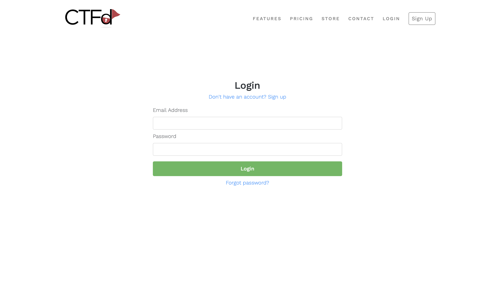
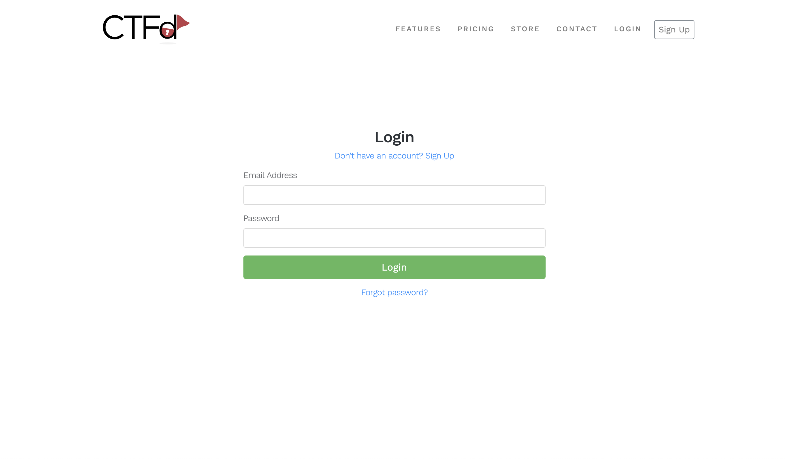
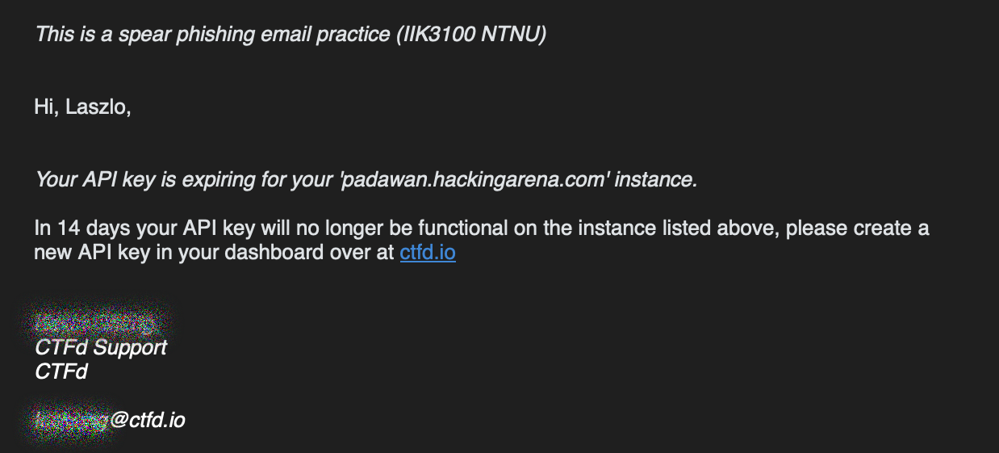

# Spear Phishing Task for IIK3100

My solution to the spear phishing task for IIK3100 - Ethical Hacking and Penetration Testing. We were tasked with creating a spear phishing website using some sort of social engineering to solve the task. This quick project took around 45 minutes to build and deploy, using Firebase Firestore to store the login data and Vue.js for the frontend.

I decided to create a fake login page for the engine powering course's [hackingarena.no](https://hackingarena.no) website. The CTF platform used during the course. Furthermore I decided to use the social engineering technique of urgency to make the user feel like they need to login as soon as possible. I did this with an email stating an API key to the platform was expiring, prompting the user to login to get a new key.


### Picture of the website result


### Picture of original website


### Picture of email sent


## Project Information

### Tools used
- Vue.js
- Tailwind CSS
- Firebase (Firestore)
- Hostinger


#### Requirements
Setup a Firebase project and Firestore database and adding the correct configuration to the project in `src/firebase.ts` or add a `.env` file with appropriate variables.

### How to run
1. Clone the repository
2. Install dependencies and run the project as a dev server
```bash
npm i && npm run dev
```

### How to deploy
1. Build the project
```bash
npm run build
```
2. Deploy the `dist` folder to a web server


## Disclaimer
This project was created for educational purposes only. I do not condone the use of phishing websites for malicious intent. This project was created as a part of a course in ethical hacking and penetration testing to learn about social engineering and how to protect against it.

