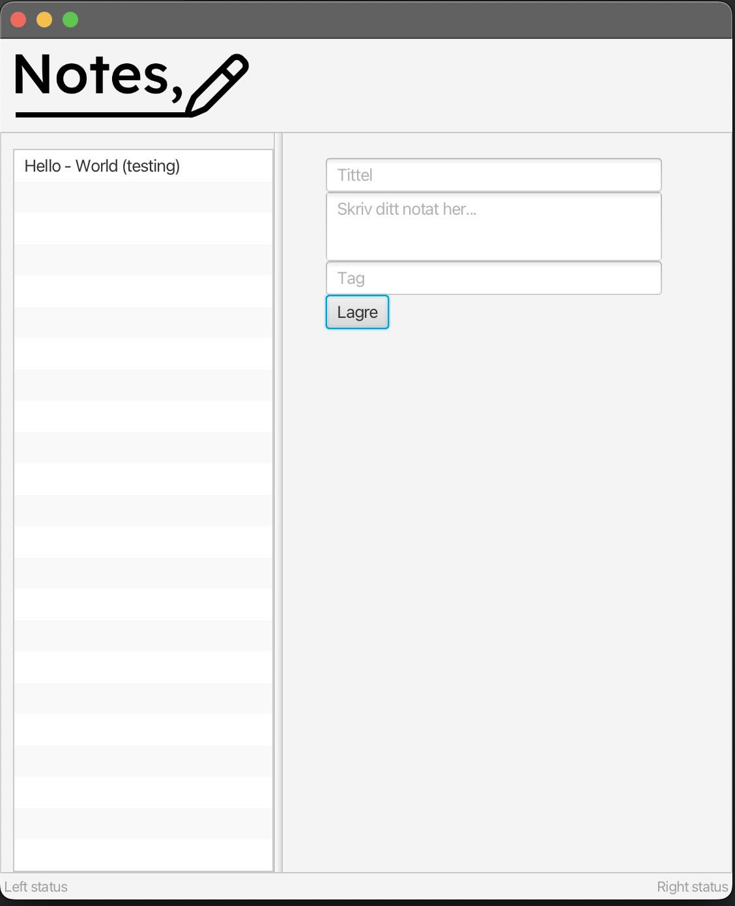

<!--
En README.md-fil (evt. en fil som README.md lenker til) inni kodingsprosjektet skal 
beskrive hva appen handler om og er ment å gjøre (når den er mer eller mindre ferdig). 
Ha med et illustrerende skjermbilde, så det er lettere å forstå. Det må også være 
minst én brukerhistorie for funksjonaliteten dere starter med.
-->

# Notes

Notes er en applikasjon for å notere ned notater. Notatet inneholder tittel, tekst for selve notatet og tag. Dette gjør man i boksene til høyre i bildet. Etter at bruker trygger på "Lagre" vil det nye notatet dukke opp i en liste over alle lagrede notater, til venstre i bildet.

Notatene blir lagret til fil, slik at man kan finne de igjen også etter man har restartet applikasjonen.

