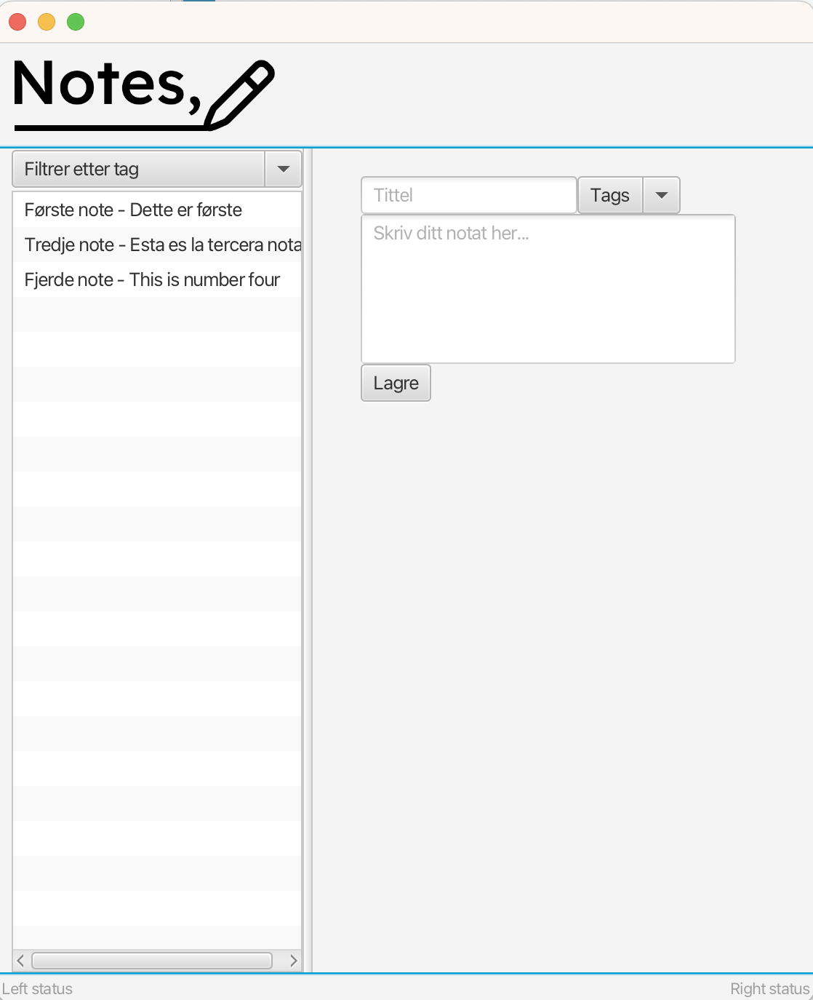
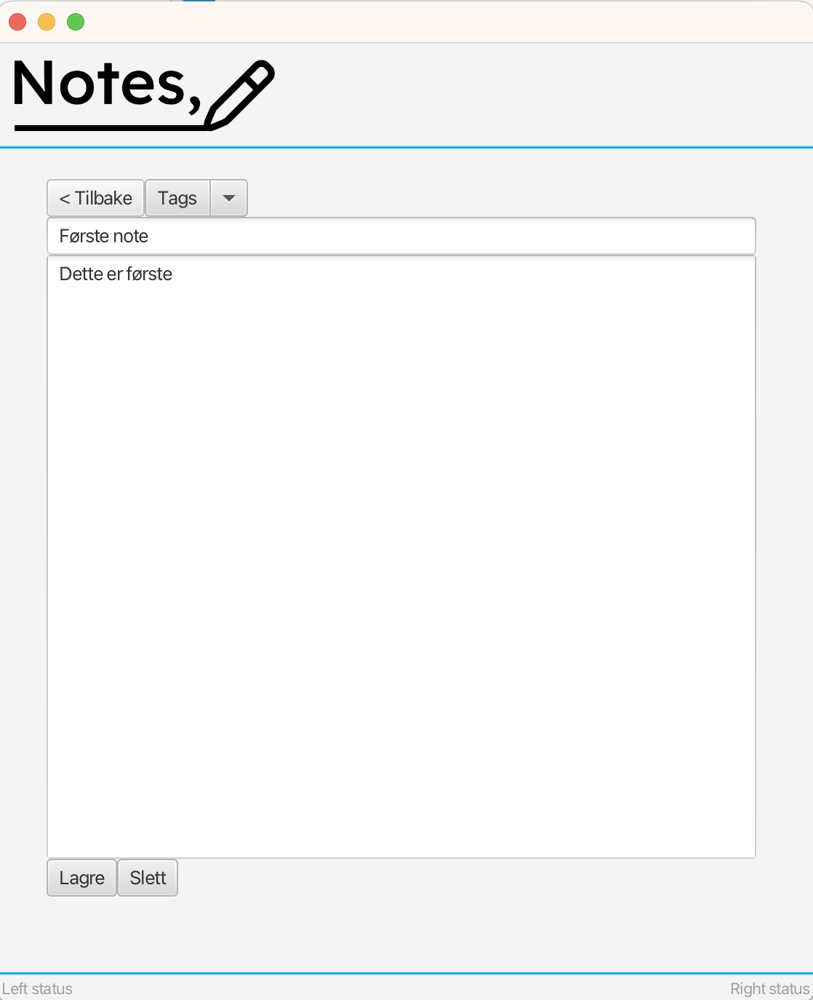

# Notes
Notes er en app som er inspirert av Google Keep og Apples "Notater". Hensikten med appen er å enkelt kunne lage et notat med tittel og innhold som kan deles inn i ulike kategorier. Det skal også være enkelt å finne fram til gamle notater, og man skal kunne redigere og slette disse. 

Appen har to hovedklasser "Note" og "NoteList" som henholdsvis beskriver et enkelt notat og en liste av notater (notatblokk). I tillegg finnes det klasser som skriver til og leser fra fil slik at man kan lagre det man har skrevet og at appen henter gamle notater når man åpner den på nytt. 

Vi har valgt å ha to kontrollere, en til et enkelt notat, og en til selve notatboka. 

Når man kjører appen ser den slik ut:


Hvis man trykker på en eksisterende note, får man opp denne siden:


## Brukerhistorier
Her vil vi legge inn brukerhistorier som skal hjelpe oss med utviklingen av applikasjonen. Slik har vi mulighet til å se
at prosjektet dekker alle ønskede krav.

### Idebank (us-1)
Som en musiker, ønsker brukeren å kunne notere ned sangideer som dukker opp, slik at hen ikke risikerer å glemme dem før hen kan få bruk for det.

Brukeren trenger å kunne kjapt legge inn en ide i et notat, som det også er enkelt å finne fram til senere når det skal
brukes. Ved å legge inn en beskrivende tittel for hvert notat/ide er det lett å holde oversikt over hvilke notater man
har. Samtidig som man lett kan finne igjen til tidligere ideer, og slette de som ikke var så gode som først tenkt.

#### Viktig å kunne se

- nåværende notat
- oversikt over alle notater

#### Viktig å kunne gjøre

- notere ned et notat
- lagre notatet
- finne igjen tidligere notat
- slette notat

## Klassediagram
``````
@startuml
Note "*" -- "1" NoteList
class Note{
    -Integer id
    -String title
    -String text
    -String tag
    +Note(Integer id, String title, String text, String tag, boolean create)
    +Note editNote(int id, String title, String text, String tag)
    #void deleteNote(int id)
    +int getId()
    +String getTitle()
    +String getText()
    +String getTag()
    +String toString()
}
class NoteList{
    -{static} HashMap<Integer, Note> notes
    -{static} HashMap<Integer, Note> initMap()
    +{static} void createNote(String title, String text, String tag)
    +{static} List<Note> getNotes()
    +{static} void deleteNote()

}
@enduml
``````
