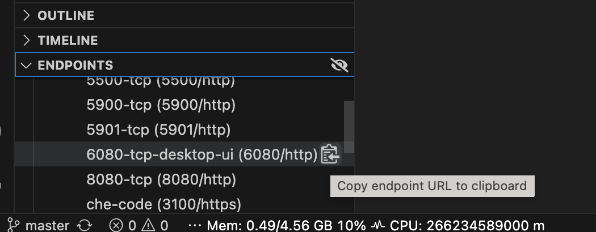

# Group gr2360 repository

### Gruppemedlemmer:

- Trond He
- Timon Alexander Selnes
- Emilie Kjeldsberg Sivertsen
- Regine Haugdal Nygård

## Innhold

Kodingsprosjektet finner man i mappa [notes](https://gitlab.stud.idi.ntnu.no/it1901/groups-2023/gr2360/gr2360/-/tree/master/notes).
Hele kodingsprosjektet er delt inn i 3 ulike releases. For hvert nye release skal appen ha mer og mer innhold og funksjon, og i den siste releasen skal appen være ferdig.

## Åpne i Eclipse Che

[Open in Eclipse Che](https://che.stud.ntnu.no/#https://gitlab.stud.idi.ntnu.no/it1901/groups-2023/gr2360/gr2360?new)

For å kunne åpne prosjektet i Eclipse Che må man passe på å ikke ha en workspace åpen i Che fra før. Når man har fått opp prosjektet må man kjøre `mvn clean install` i **notes**. Deretter kan man for eksempel kjøre appen ved å bruke `mvn javafx:run` i **notes/ui**. For å kunne se selve appen må man kopiere og lime inn en link til en "skjerm" i nettleseren. Den linken finner man under "Endpoints" helt nederst til venstre:

## Bygging og kjøring av prosjektet

Prosjektet bruker maven til bygging og kjøring.

For å bygge prosjektet, gå til **/notes** og kjør `mvn compile`.

For å kjøre testene, gå til **/notes** og kjør `mvn test`.

For å kjøre applikasjonen, gå til **/notes/server** og kjør `mvn spring-boot:run`.
Deretter gå til **/notes/ui** og kjør `mvn javafx:run`.

## Testdekningsgrad og kodekvalitet

Kjør `mvn verify` i **/notes**, for å kjøre tester med testdekningsgrad og kodekvalitet.
Resultater finnes i **Target** innenfor hver modul.

### Jacoco

Jacoco er brukt til å rapportere testdekningsgrad.

### Checkstyle

Checkstyle er brukt til å sjekke formatering i prosjektet.
Det er tatt utgangspunkt i google sin checkstyle konfigurasjonsfil (google_checks.xml),
med noen modifikasjoner slik at det passer vårt prosjekt. Slik som indent avstand.

### Spotbugs

Spotbugs er brukt til å lete etter feil i koden.
